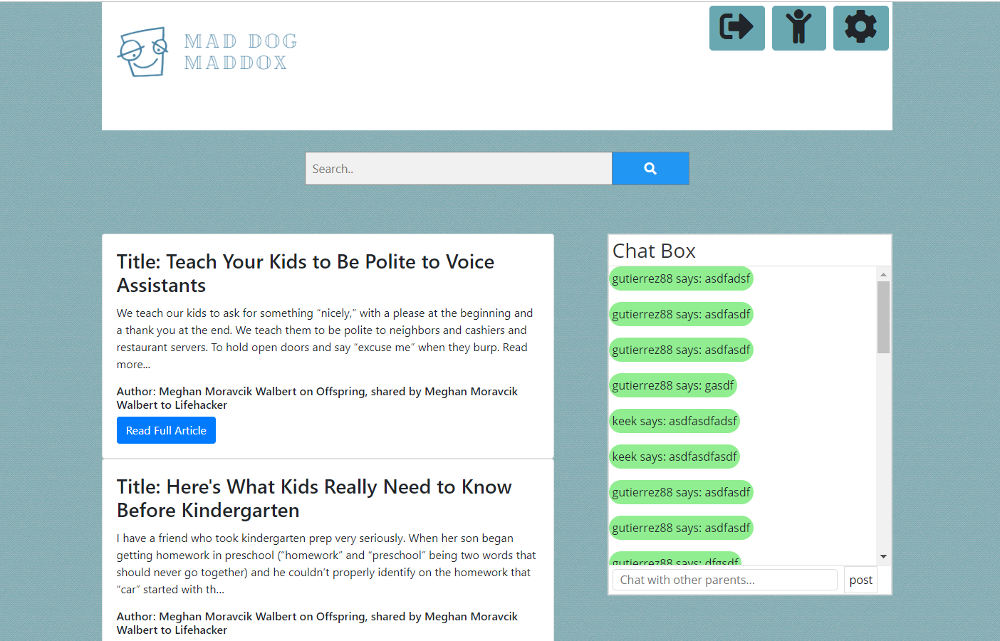
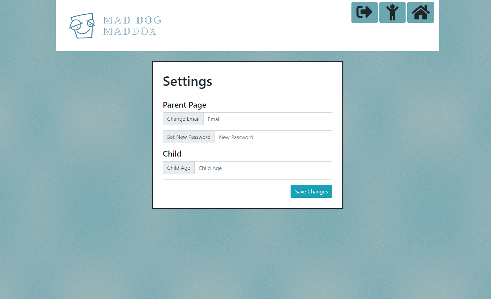

 <h2> Mad Dog Maddox</h2>

https://rickiangela.github.io/Project-One/

 * This is a family-friends website that can be used by both parent and child.  
* To begin a parent must register to access the site.  We are using firebase to store the user names, email, passward, child's name and age. 

* Once logged in they will come to an acess page where they will see the users on their account.  
* The parent can chose a time the child is allowed to use the site.  Once the time runs out it will default back to the sign-in page.  This will limit the child from getting into the parent's page and changing the settings. 

* The parents will have a section that will allow them to search for articles on parenting and have a forum for them to talk with other parents.
* The parent section will also allow the user to edit setting.  Like changing email, password or the child's age.

* The child's page is where they can watch videos without the parents worrying about what their kids are watching. 
* The child content and video search will be restricted to age appropriate content. 
* Each of the child's pages are target to specific age groups.  

* Page One is for children from ages 0-5

* Page Two is for children from ages 6-10

<h3>Technology Used</h3>
<li> News API<li>
<li> Youtube API</li>
<li> Firebase Database </li>
<li> Firebase Authentication </li>
<li> Chat (powered by Firebase Database)</li>

<h2>Developer Teams</h2>

<h3>Front End Team</h3>
 <li> Ricki Echevarria</li>
 <li> CJ Summers<li> 
    * Team Responsible for HTML/CSS

<h3>Back End Team</h3>
<li> Matthew Weaber</li>
<li> Ryan Gutierrez</li>
   * Team Responsible for the API/Javascript
 
 
 
